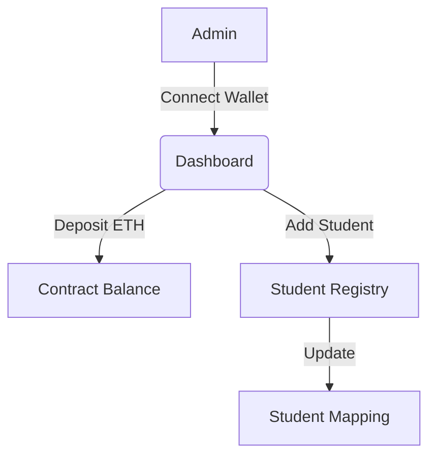
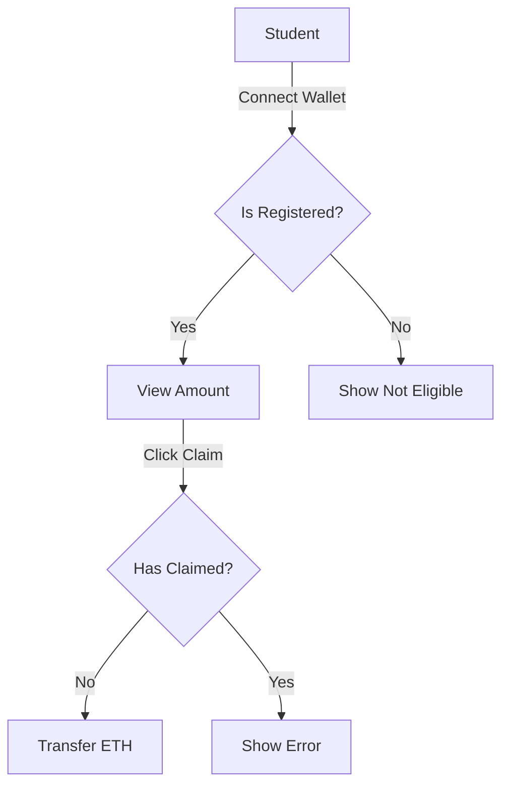

# Decentralized Scholarship/Bursary Distribution System

A complete, production-ready DApp built with Solidity, Hardhat, and React (Vite) for managing and distributing scholarships on the blockchain.

## 🌟 Features

### For Admins
- **Add Students**: Register students with their wallet address and allocated amount.
- **Fund Management**: Deposit ETH into the contract and withdraw unused funds.
- **Dashboard**: View all registered students and contract balance.
- **Security**: Only the owner can perform sensitive actions (OpenZeppelin `Ownable`).

### For Students
- **Eligibility Check**: Connect wallet to check if a scholarship is allocated.
- **Claim Funds**: One-click claim process to receive ETH directly to their wallet.
- **Status Tracking**: View real-time claim status (Pending/Claimed).
- **Safety**: Reentrancy guards prevent double-spending or reentrancy attacks.

---

## 🏗 Architecture

### Smart Contract (`ScholarshipFund.sol`)
- **State Variables**:
  - `students`: Mapping of address to Student struct.
  - `studentList`: Array of addresses for iteration.
  - `owner`: The admin address.
- **Key Functions**:
  - `addStudent`: Registers a beneficiary.
  - `claimScholarship`: Transfers funds to the student.
  - `depositFunds`: Adds ETH to the pool.
- **Events**:
  - `StudentAdded`, `ScholarshipClaimed`, `FundDeposited`.

### Frontend
- **React + Vite**: Fast, modern UI.
- **Ethers.js v6**: Blockchain interaction.
- **Tailwind CSS**: Styling.

---

## 🚀 Setup & Deployment

### Prerequisites
- Node.js & Bun (or npm)
- MetaMask extension

### 1. Backend Setup (Smart Contract)

```bash
cd backend
bun install
```

**Compile Contract:**
```bash
bun run hardhat compile
```

**Deploy to Localhost:**
1. Start local node:
   ```bash
   bun run hardhat node
   ```
2. Deploy contract (in a new terminal):
   ```bash
   bun run hardhat run scripts/deploy.ts --network localhost
   ```
   *Copy the deployed address from the console output.*

### 2. Frontend Setup

```bash
cd frontend
bun install
```

**Configure Environment:**
1. Open `src/constants.js`.
2. Paste the deployed contract address into `CONTRACT_ADDRESS`.
3. (Optional) If you modified the contract, copy the new ABI from `backend/artifacts/contracts/ScholarshipFund.sol/ScholarshipFund.json` into `CONTRACT_ABI`.

**Run App:**
```bash
bun run dev
```

---

## 🧪 Testing

Run the comprehensive test suite to ensure contract security and logic.

```bash
cd backend
bun run hardhat test
```

**Test Coverage:**
- Deployment & Ownership
- Admin functions (Adding students, depositing)
- Student flows (Claiming, double-claim prevention)
- Security checks (Unauthorized access)

---

## 📊 Flowcharts

### Admin Flow


### Student Flow


---

## 📜 License
MIT
